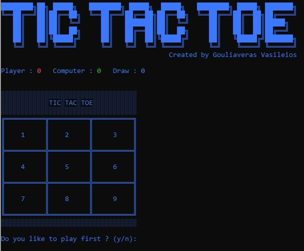
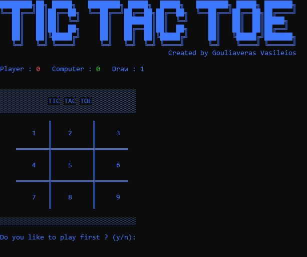

# [Tic Tac Toe] (http://ozz1.ddns.net)

Tic Tac Toe is a game for two players, X and O, who take turns marking the spaces in a 3×3 grid. The player who succeeds in placing three of their marks in a horizontal, vertical, or diagonal row wins the game.

## How to play

1. The game is played on a 3x3 board
2. Players take turns to choose the cell on the game board.
3. Place three of the symbols in a row, column or diagonal to win
4. If the entire board is filled and there is no winner, the game is a draw.  
    Good Luck! :)

##Features

* The Menu  

* Menu Option 2  

* Menu Option 1 Start the Game and Select board style  

* Board 1 Gameplay  

* Board 2 Gameplay  

